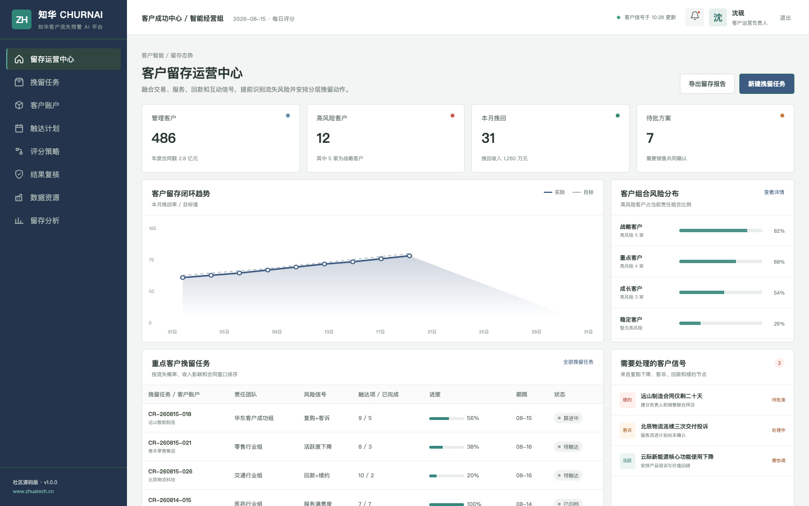
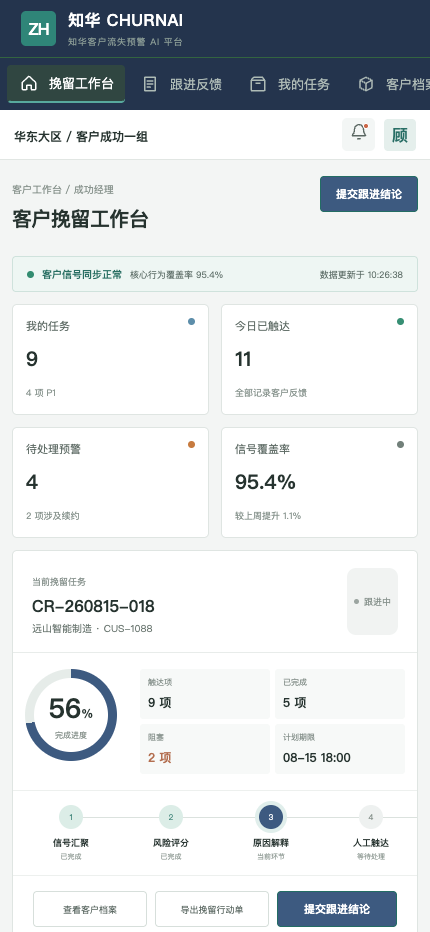

# 知华客户流失预警 AI · ZhuaTech ChurnAI

客户流失不是一个分数，而是一组需要被看见、解释和跟进的经营信号。

[官网](https://www.zhuatech.cn/) · [API](docs/api.md) · [架构](docs/architecture.md) · [部署](deploy/README.md) · [许可](LICENSE)

---

ChurnAI 是知华科技（**上海如静知华信息科技有限公司**）面向个人学习与交流发布的客户成功 AI 社区源码项目。系统采用 Java 21、Spring Boot、Vue 3 与 MySQL，提供客户流失评估、挽留任务和效果复盘的完整示例。

## 从信号到挽留行动

系统将复购间隔、近 90 日订单频次、客诉、回款延迟、互动活跃度和合同剩余周期转化为可解释风险。模型输出只辅助排定优先级，客户联系、优惠策略和合同决策由业务人员确认。



管理端用于观察客户组合风险、留存趋势、重点挽留任务、触达计划与复核队列。



移动端聚焦“今天要跟进谁”：展示风险证据、客户档案、任务步骤、触达反馈和风险升级。

## 已实现模块

| 业务域 | 社区版实现 |
| --- | --- |
| 客户洞察 | 客户分群、行为信号、风险原因与优先级 |
| AI 评估 | `POST /api/ai/churn/predict`，返回概率、分层和建议动作 |
| 挽留运营 | 任务队列、触达计划、结果记录和效果复盘 |
| 工程能力 | JWT、JPA、Flyway、H2 测试、MySQL、Docker Compose |
| 前端体验 | Vue 3 管理驾驶舱与响应式 H5 工作台 |

Java 工程包名：`cn.zhuatech.churnai`。本地评分规则不依赖外部模型密钥，便于学习、测试和替换为企业自有模型。

## 运行社区演示

```bash
cd frontend
npm install
npm run dev:demo
```

浏览器打开 `http://localhost:5173`。演示账号：管理端 `planner / Demo@2026`，H5 端 `operator / Demo@2026`。演示客户、联系人、合同与经营指标均为虚构数据。

## 非商业使用声明

本工程仅允许个人、非商业性的学习、研究与技术交流，**不得商用**。企业内部使用、生产部署、SaaS、收费服务、项目交付、品牌替换或二次销售，必须提前获得上海如静知华信息科技有限公司书面授权。具体以 [LICENSE](LICENSE) 为准。

如需 CRM/CDP 接入、客户成功体系、AI 私有化或软件外包服务，可访问[知华科技官网](https://www.zhuatech.cn/)或通过两个微信二维码咨询：

| 产品技术咨询 | 授权与项目定制 |
| --- | --- |
|  |  |

版权所有 © 2026 上海如静知华信息科技有限公司。

关键词：客户流失预警、客户成功 AI、续费预测、会员运营、CRM AI、Java 客户管理源码、知华科技。
